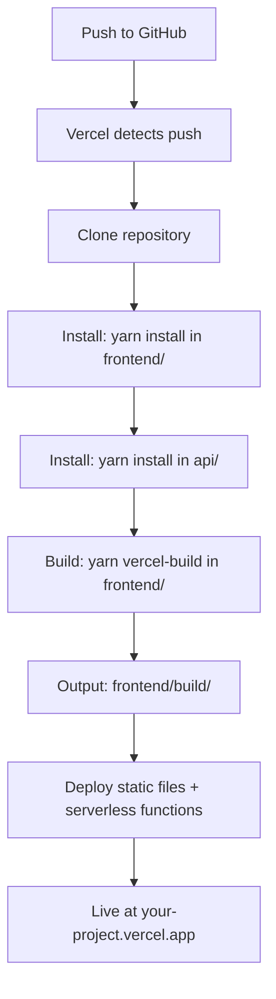

# Vercel Build Configuration Guide

## 📁 Repository Structure

Your repository has this structure:

```
/ (repository root)
├── api/
│   ├── appointment.js       # Serverless function
│   └── package.json         # Node.js dependencies
├── frontend/
│   ├── src/                 # React source code
│   ├── public/
│   ├── package.json         # React dependencies
│   └── craco.config.js      # CRACO configuration
├── vercel.json              # Vercel configuration
├── .vercelignore            # Files to ignore during build
└── README.md
```

**Note:** There is NO `/app/` directory in the repository. The `/app/` path only exists in your local Emergent workspace.

---

## ⚙️ Vercel Build Configuration

### vercel.json Explanation

```json
{
  "version": 2,
  "name": "optimus-design-customs",
  "builds": [
    {
      // Build the React frontend
      "src": "frontend/package.json",
      "use": "@vercel/static-build",
      "config": {
        "distDir": "build"  // Output directory name
      }
    },
    {
      // Build serverless functions
      "src": "api/*.js",
      "use": "@vercel/node"
    }
  ],
  "routes": [
    {
      // Route /api/* to serverless functions
      "src": "/api/(.*)",
      "dest": "/api/$1"
    },
    {
      // Check filesystem first (for static files)
      "handle": "filesystem"
    },
    {
      // All other routes go to React app
      "src": "/(.*)",
      "dest": "/frontend/$1"
    }
  ]
}
```

### How Vercel Detects Build Configuration

1. **Detects framework:** Vercel sees `frontend/package.json` with `react-scripts`
2. **Looks for build script:** Finds `vercel-build` or `build` in package.json
3. **Runs build:** Executes `yarn install && yarn vercel-build` in `frontend/` directory
4. **Outputs to:** `frontend/build/` directory (configured in vercel.json)
5. **Serverless functions:** Automatically detected from `/api/` directory

---

## 🔨 Build Process

### What Happens When You Deploy



### Build Commands Executed

```bash
# 1. Install frontend dependencies
cd frontend
yarn install

# 2. Build frontend
yarn vercel-build  # Runs: craco build

# 3. Install API dependencies
cd ../api
yarn install

# 4. Deploy
# - Static files from frontend/build/
# - Serverless functions from api/
```

---

## 📝 Required Files

### frontend/package.json

Must have `vercel-build` script:

```json
{
  "scripts": {
    "start": "craco start",
    "build": "craco build",
    "vercel-build": "craco build"  // ← Required for Vercel
  }
}
```

**Why `vercel-build`?**
- Vercel looks for this script first
- Falls back to `build` if not found
- Allows custom build logic for Vercel

### api/package.json

```json
{
  "dependencies": {
    "@supabase/supabase-js": "^2.39.0",
    "resend": "^3.2.0"
  }
}
```

---

## 🚫 .vercelignore

Tells Vercel what NOT to upload/build:

```
node_modules/          # Reinstalled during build
backend/               # Python backend (not used)
.env                   # Set in Vercel dashboard
*.log                  # Log files
.DS_Store              # OS files
```

---

## 🔧 Vercel Dashboard Settings

### Framework Preset
- Select: **Other** (because we have custom vercel.json)
- OR: **Create React App** (Vercel auto-detects)

### Root Directory
- Leave as: **`./`** (repository root)
- DO NOT set to `frontend/` or `app/`

### Build & Output Settings

**Override?** NO - let vercel.json handle it

If you must override:
- Build Command: `cd frontend && yarn install && yarn build`
- Output Directory: `frontend/build`
- Install Command: `yarn install --cwd frontend && yarn install --cwd api`

---

## 🔍 Troubleshooting

### Error: "Could not find package.json"

**Cause:** Wrong root directory or build path

**Fix:**
1. Check Vercel dashboard → Project Settings → General
2. Root Directory should be `./`
3. Check vercel.json paths are relative to repository root

### Error: "Build failed with exit code 1"

**Cause:** Missing dependencies or build error

**Fix:**
1. Check Vercel build logs for specific error
2. Test build locally:
   ```bash
   cd frontend
   yarn install
   yarn build
   ```
3. Check all dependencies are in package.json

### Error: "CRACO command not found"

**Cause:** @craco/craco not installed

**Fix:**
- Already in devDependencies ✓
- Vercel installs devDependencies by default ✓

### Error: "API route returns 404"

**Cause:** Routing configuration issue

**Fix:**
1. Check vercel.json routes
2. Ensure api/*.js files exist
3. Check function runtime in Vercel dashboard

### Error: "Environment variables not found"

**Cause:** Not set in Vercel dashboard

**Fix:**
1. Go to Vercel Dashboard → Project → Settings → Environment Variables
2. Add all required variables
3. Redeploy

---

## 🧪 Local Testing

### Test Vercel Build Locally

```bash
# Install Vercel CLI
npm i -g vercel

# Run development server
vercel dev

# Test build
vercel build
```

### Test Production Build

```bash
# Build frontend
cd frontend
yarn install
yarn build

# Check output
ls -la build/

# Test serverless function
cd ../api
yarn install
node -e "const handler = require('./appointment.js'); console.log(handler)"
```

---

## 📊 Build Output

After successful build, Vercel serves:

```
Static Files (from frontend/build/):
├── index.html
├── static/
│   ├── js/
│   ├── css/
│   └── media/
└── ...

Serverless Functions (from api/):
└── /api/appointment  → api/appointment.js
```

**URLs:**
- Frontend: `https://your-project.vercel.app/`
- API: `https://your-project.vercel.app/api/appointment`

---

## ✅ Deployment Checklist

Before deploying:

- [ ] All changes committed to GitHub
- [ ] `vercel.json` in repository root
- [ ] `frontend/package.json` has `vercel-build` script
- [ ] `api/package.json` has all dependencies
- [ ] `.vercelignore` configured
- [ ] Environment variables documented

In Vercel Dashboard:

- [ ] Repository connected
- [ ] Root Directory = `./`
- [ ] Framework = Other or Create React App
- [ ] All environment variables added
- [ ] Build & Deploy triggered

After deployment:

- [ ] Site loads successfully
- [ ] Booking form works
- [ ] API endpoint responds
- [ ] Data saves to Supabase
- [ ] Email sends via Resend
- [ ] No console errors

---

## 🚀 Deployment Flow

```
Local Workspace                 GitHub                    Vercel
    (Emergent)
    
    /app/                       / (root)                  Deployed Site
    ├── frontend/   ─────►     ├── frontend/   ─────►   https://your-project.vercel.app
    ├── api/                    ├── api/                 
    └── vercel.json             └── vercel.json          
```

**Key Point:** 
- Emergent workspace has `/app/` prefix
- GitHub repository does NOT have `/app/` prefix
- Vercel uses GitHub structure (no `/app/`)

---

## 💡 Pro Tips

1. **Test locally first:** Use `vercel dev` before deploying
2. **Check logs:** Vercel Dashboard → Deployments → View Logs
3. **Preview branches:** Every PR gets a preview URL
4. **Instant rollback:** Click any previous deployment to restore
5. **Environment variables:** Can be different per environment (Production/Preview/Development)

---

## 📚 Resources

- [Vercel Documentation](https://vercel.com/docs)
- [Vercel CLI](https://vercel.com/docs/cli)
- [Build Configuration](https://vercel.com/docs/build-step)
- [Serverless Functions](https://vercel.com/docs/functions/serverless-functions)
